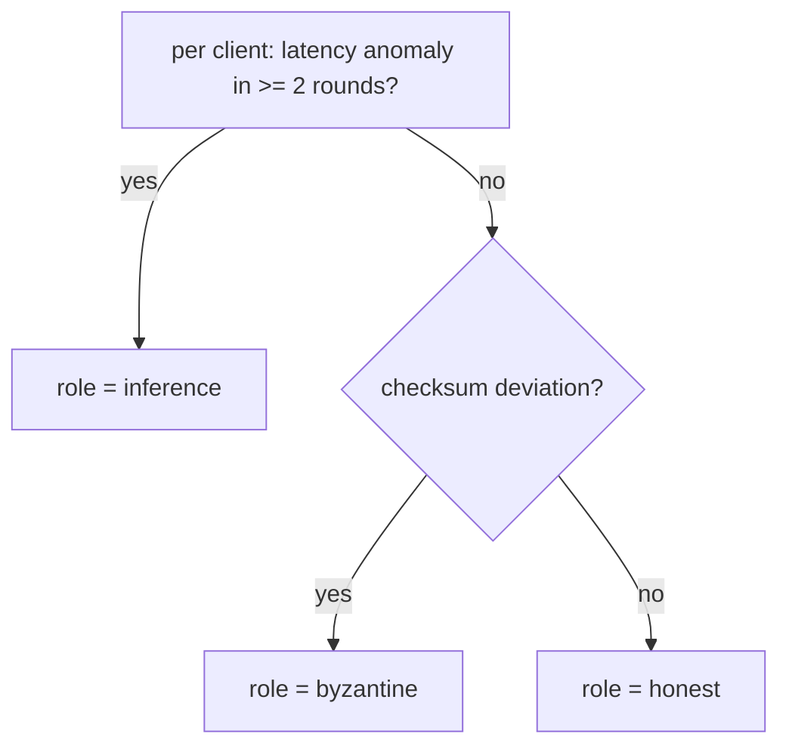

# How the audit works

This document explains the mechanism the demo reproduces and how it maps to the
paper. It is self-contained and does not depend on an external codebase. The demo inlines every detector primitive named
here (see [`inference_audit_demo.py`](../inference_audit_demo.py)).

## The setting

Cross-silo federated learning: a handful of accountable organizations train a
shared model, coordinated by a server that is trusted (operated under a
contractual and audit framework), while clients may be curious or malicious. The
standard view is that a participant who merely observes the global models can
run passive inference attacks (membership, property inference) without being
detected, and that the only recourse is differential privacy, which trades away
the accuracy that motivated forming the federation.

The audit takes a different route: a trusted server is not limited to averaging
updates, it can interrogate the participants.

## The challenge-response audit

Each round the server:

1. constructs a small secret challenge batch `B_t`,
2. evaluates the gradient `g_t` that `B_t` induces on the current global model
   and reduces it to a reference checksum,
3. asks every client to return the same checksum, computed on the model state
   it actually used, together with the time the local computation took.

From the two returned signals it forms one two-dimensional feature per client:

- **checksum deviation** - did the client's challenge gradient match the
  reference?
- **latency anomaly** - did the client's local round take anomalously long?

```mermaid
sequenceDiagram
    autonumber
    participant S as Server
    participant C as Client c
    Note over S,C: Round t. Server trusted; client may be curious or malicious
    S->>S: derive secret challenge batch B_t
    S->>S: reference gradient g_t and its quantized fingerprint
    S->>C: broadcast model theta_t and challenge spec
    C->>C: local training round, then challenge gradient on the model state used
    C->>S: return checksum and local latency
    S->>S: deviation = block-mismatch fraction above tolerance tau
    S->>S: latency-flag = modified z-score above kappa
    Note over S: after the run, combine both signals into role(c)
```

## Signal 1: the checksum (quantized-gradient fingerprint)

A client that evaluated the distributed model on the specified data reproduces
the reference gradient, and therefore the reference checksum. A client that
**mutated** the model (for example a GAN attacker that repurposes the shared
model as a discriminator) produces a different gradient.

An exact hash of a floating-point gradient is fragile across heterogeneous
hardware (non-associative summation, fused multiply-add, ARM vs x86, CPU vs
GPU). The audit therefore compares a **quantized fingerprint** under a small
tolerance:

- `quantize(grad, q)` rounds each coordinate to the relative grid
  `q * mean(|grad|)`, so `q` is a dimensionless determinism margin;
- `fingerprint(grad, q)` splits the quantized gradient into blocks of
  `BLOCK_SIZE = 256` coordinates and hashes each with SHA-256, so the
  fingerprint is one digest per block;
- `mismatch_fraction(a, b, q)` is the fraction of **blocks** that differ — a
  block counts as differing if any coordinate in it lands on a different
  quantization level;
- a client is checksum-flagged when that fraction exceeds the tolerance
  `tau = 0.05`;
- `challenge_blocks(n, key)` derives from the challenge secret the random subset
  of `SUBSAMPLE = 256` blocks the server actually asks for, so the response and
  the hashing cost do not grow with the model.

Honest cross-platform drift moves a negligible fraction of coordinates, while a
model-mutating attack moves a large fraction, so any `tau` between the two
separates them with orders of magnitude of headroom. Two properties make this
work: the relative step `q * mean(|grad|)` is **scale-invariant** (a global
rescaling of an honest gradient leaves the fingerprint unchanged), and fixing the
block **size** rather than the block count keeps the honest mismatch bounded
independent of model size. The paper measures this across four machines: the
exact hash differs in every heterogeneous pair, while the tolerant block mismatch
runs from 0.0042 (same architecture and OS) through 0.0208 (across operating
systems) and 0.0250 (across instruction sets) to 0.0321 (both differ), all below
`tau = 0.05`. Instruction set is the largest single term. `--determinism --pair`
models each measured pair, defaulting to the 0.0321 worst case. Run
`python inference_audit_demo.py --determinism` to see the same contrast (exact
hash differs for an honest cross-hardware client, tolerant fingerprint accepts
it, both active attacks flagged), and `portable_checksum_probe.py` to reproduce
it across your own machines. Because GPU evaluation can diverge more, the tiny
challenge gradient is best computed on CPU.

## Signal 2: the latency (median/MAD modified z-score)

A client that runs an extra in-band analytic pass (a passive membership test
probing many records, or the optimization of a generative attack) spends
measurable extra time. The server scores each client's per-round time against
the cohort with a robust modified z-score:

```
z = 0.6745 * (latency - median) / MAD
```

The MAD is floored to protect tight honest cohorts from blowing up the scores:
`MAD = max(MAD, rho * |median|, tau_min)` with a relative floor `rho = 0.1` and
an absolute floor `tau_min = 1 ms`. A client is latency-flagged in a round when
`z > kappa` (the demo uses the benchmark value `kappa = 2.5`).

The robust statistic matters: it is why a single attacker stands out against an
honest majority, and why an honest **majority** is needed (too many simultaneous
attackers shift the cohort median and inflate the MAD, masking the signal - a
concrete instance of the paper's small-cohort discussion).

## Combining the two signals (the role rule)

`combine_time_correctness(deviations, latency_flags)` resolves each client to one
of three roles, with a two-round persistence rule so isolated stochastic spikes
are not mistaken for attacks:

| persistent latency anomaly (>= 2 rounds) | checksum deviation | role |
|:---:|:---:|---|
| yes | (either) | **inference** |
| no  | yes | **byzantine** |
| no  | no  | **honest** |



This is the mechanism that separates *manipulation* (Byzantine corruption) from
*curiosity* (inference), which pure robustness defenses conflate:

- a **passive** membership-inference attacker maps to `inference` via latency
  alone - it never touches the model, so its checksum matches, yet its extra
  analytic time is detected, all without privacy noise;
- a **model-mutating generative** attacker shows both signals and maps to
  `inference`;
- a **Byzantine** corruptor shows a checksum deviation without persistent
  latency and maps to `byzantine`.

The checksum half (catching the model-mutating attackers) is the reliable,
deployable contribution. The latency half is not: it flags the passive attacker
in these clean conditions, but that detection does **not** survive realistic
wide-area jitter (run `--sweep`, and see `limitations.md`). And the passive
threat is genuine — in the paper the state-of-the-art LiRA attack (Carlini et
al. 2022) reaches a 15.8% true-positive rate at 0.1% false-positive rate (online AUC 0.85) on real CIFAR-10 — so robustly detecting passive inference stays the domain of
differential privacy.

## What is real and what is modelled in the demo

- **Real:** the checksum deviations. They come from quantized challenge
  gradients of an actual small model, so the honest/passive clients genuinely
  match the reference and the mutating clients genuinely diverge.
- **Modelled:** the latencies. The audit only ever observes a per-round time, so
  the demo adds a behaviour's extra compute as a latency delta and adds optional
  wide-area jitter. This mirrors the paper's controlled latency experiments and
  keeps the demo deterministic and dependency-free.

## Function reference

All of these are inlined in [`inference_audit_demo.py`](../inference_audit_demo.py):

| function | purpose |
|---|---|
| `quantize(grad, q)` | round a gradient to the relative grid `q * mean(|grad|)` |
| `block_count(grad)` | number of fixed-size blocks the gradient splits into |
| `fingerprint(grad, q, ...)` | SHA-256 digest per block of `BLOCK_SIZE` coordinates |
| `challenge_blocks(n_blocks, key)` | the challenge-derived subset of blocks the server asks for |
| `mismatch_fraction(a, b, q)` | fraction of fingerprint **blocks** that differ |
| `modified_zscore_per_round(latencies, ...)` | per-round median/MAD modified z-scores (floored MAD) |
| `combine_time_correctness(deviations, latency_flags)` | the two-signal role rule |
| `run_demo(seed, rounds, kappa, probe_s, jitter_s, round_base_s)` | run the synthetic audit, return `(clients, deviations, latency_flags, roles)` |

## Mapping to the paper

| demo element | paper |
|---|---|
| block fingerprint (256 coords/block) + tolerance `tau = 0.05` | Section IV-A (checksum, determinism margin) |
| challenge-derived block subsampling (`S = 256`) | Section IV-A (bounded response and hashing cost) |
| median/MAD z-score, floors, `kappa` | Section IV-A (latency indicator) |
| two-signal role rule, persistence `L_min = 2` | Section IV-A (role rule) |
| `--sweep` long vs short round | Sections VI-E / VI-F (jitter robustness, operating conditions) |
| offline-decoupled attacker evading | Section VI-G (evasion surface) |

See also [limitations.md](limitations.md) for the boundary and [usage.md](usage.md) for how to run each part.
